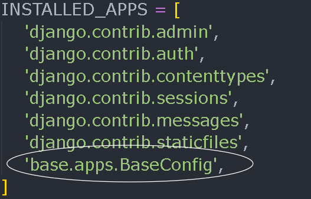

# Codewarriors
## [Site Link](https://backend.codewarriors.site/)
- Please donot forget to test the site,signIn and submit 1 or more submissions.Waiting for your feedback. Thanks!
## Index

- [Overview](#overview)
- [Setup Guide](#setup-guide)
- [Pages](#pages)
- [How to Create an Online Compiler](#how-to-create-an-online-compiler)
- [Database Schema Overview](#database-schema-overview)
- [CRUD](#crud)

## Overview
Codewarriors is a web application developed with Django designed to provide a platform for coding problems and challenges. It allows users to browse, solve, and submit coding problems while offering functionalities for problem management, user profiles, and leaderboards. The application serves as a resource for practicing coding skills and competing with others.
## Setup Guide

This guide provides instructions for setting up and running the Django project.

1. Clone the repository from GitHub or set up the project from scratch:

    ```bash
    git clone https://github.com/Vaibhav11022003/Online-Judge.git
    ```

2. Install `virtualenv` if you haven't already:

    ```bash
    pip install virtualenv
    ```

3. Create and activate a virtual environment:

    ```bash
    virtualenv [envname]
    source [envname]/Scripts/activate  # On Windows, use [envname]\Scripts\activate
    ```

4. Install Django within the virtual environment:

    ```bash
    pip install django
    ```
    If you know the basics of Django and just want to copy the project ten install all requirements:

    ```bash
    pip install -r requirements.txt
    pip list
    ```

5. Create a new Django project:

    ```bash
    django-admin startproject online-compiler
    ```

6. Paste your `.env` file (if applicable) inside the project directory.

7. Run the development server to verify the setup:

    ```bash
    python manage.py runserver
    ```

8. Create new Django apps and connect them to the main project:

    ```bash
    python manage.py startapp base
    python manage.py startapp [appname]
    ```

9. Add these apps to the `INSTALLED_APPS` list in `online-compiler/settings.py`.

10. Create a `templates` folder in the project directory to contain the main HTML pages. Inside the `base` app directory, create another `templates` folder:

    - Within `base/templates/`, create a folder named after the app (e.g., `base/`).
    - Inside this app-specific folder, create HTML templates using Jinja templates.


11. Create a `urls.py` file in the `base` app directory to manage URL routing for the app.

12. Create a `static` folder in the project directory to contain all images, CSS, and JavaScript files. Connect static files to the project by adding the static directory to `online-compiler/settings.py`:

    ```python
    STATICFILES_DIRS = [
        os.path.join(BASE_DIR, 'static'),
    ]
    ```

Once you've set up the project, you can start developing. Create views, models, and other components as needed. For additional help or troubleshooting, refer to the Django documentation.
For more information, refer to the [Django documentation](https://docs.djangoproject.com/en/stable/).
## Pages

### 1. Login / SignUp / Logout
- **Purpose:** Manages user authentication and authorization.
- **Features:**
  - **Login:** Users enter their username and password. The authentication function:
    - Converts the username to lowercase and searches for it in the user database.
    - If no match is found, returns "No user exists."
    - If a match is found, it hashes the entered password (using SHA-256) and compares it with the stored hash.
    - If the password matches, the user is logged in successfully; otherwise, returns "Username or password is not correct."
  - **SignUp:** Users create an account by entering a username and password.
  - **Logout:** Uses Django’s built-in `logout()` function to log out users.

### 2. Home Page (Problem Set)
- **Purpose:** The main page of the website where users can browse coding problems. Problems can be filtered by difficulty level (easy, medium, hard), tags, or searched directly by title. Users can select a problem to solve based on these criteria.

### 3. Solve Problem
- **Purpose:** This page displays the full description of a coding problem. It includes:
  - **Problem Statement:** Detailed description of the problem.
  - **Constraints:** Time and space constraints.
  - **Input Format:** Specifications for the input.
  - **Output Format:** Specifications for the output.
  - **Example Test Cases:** Examples with brief explanations.
- **Features:**
  - Users can choose the programming language in which to code.
  - Users can test their code against example test cases using the "Run" button.
  - Users must log in or sign up before submitting their solution.
  - After submission, users receive feedback on their solution, including the number of test cases passed.
  - Users can view their previous submissions as well as other users’ submissions.

### 4. Create Problem
- **Purpose:** This page is accessible only to staff or superusers and is used to create new coding problems.
- **Features:** Allows the creation of problems with detailed statements, constraints, and tags.

### 5. User Profile
- **Purpose:** Displays a summary of the user's coding profile.
- **Features:**
  - Shows the number of problems solved categorized by difficulty (easy, medium, hard).
  - Displays the user’s most recent submissions.

### 6. Add Test Cases / Add Dummy Test Cases
- **Purpose:** This page is accessible only to staff or superusers and is used to add or update test cases for existing problems.
- **Features:**
  - **Add Test Cases:** Input additional test cases and their expected outputs.
  - **Add Dummy Test Cases:** Add dummy test cases for testing purposes.

### 7. Leaderboard / Hall of Fame
- **Purpose:** Displays user rankings based on the points they have scored from solving problems.
- **Features:**
  - Points are awarded as follows:
    - Easy problem: 50 points
    - Medium problem: 100 points
    - Hard problem: 200 points
  - Ranking Criteria:
    - Total score
    - Number of hard problems solved
    - Number of medium problems solved
    - Number of easy problems solved

### 8. User Submission / All Submissions
- **Purpose:** Displays the top 100 latest submissions for a specific problem.
- **Features:** Lists recent submissions sorted by date.

### 9. Submission Page
- **Purpose:** Displays the full code and details of a particular submission made by a user.
- **Features:** Shows the submitted code and related metadata.

## How to create an online compiler 
(i.e. `run_code(language, code, input_data)` function of `views.py`)

The project includes the following directories and files:
- **`codes/`**: Directory where the compiled code files are stored.
- **`inputs/`**: Directory where user input files are saved.
- **`outputs/`**: Directory where the output files are saved.

## How It Works

1. **Code Submission**: When a user submits code along with input, the system generates a file in the `codes/` directory based on the selected language. For example, if the user selects C++, a file named `random_number.cpp` is created with the provided code.
```python
random_number=str(uuid.uuid4())
```

2. **Input File Creation**: An input file named `random_number.txt` is created in the `inputs/` directory to store the user’s input.

3. **Code Execution**: The system then compiles and runs the code using terminal commands. The input file is passed to the code execution function. The output of the code execution is captured as a string.

4. **Output File Creation**: The output, which could be the result of the code execution or error messages, is saved in a file named `random_number.txt` in the `outputs/` directory.

## Output Types

The output of the compilation and execution process can be:
- **`compile-time-error with description`**: If there are issues during the compilation of the code.
- **`runtime-error with description`**: If the code runs into problems during execution.
- **`respective string`**: The output of the code if it runs successfully.

## Notes

- Ensure that the directory structure (`codes/`, `inputs/`, and `outputs/`) is correctly set up for proper file handling.
- The system should handle various programming languages by generating appropriate files and commands for compilation and execution.

## Database Schema Overview

### Tables

#### `users`
Stores information about the users of the platform.
- **id** (int, pk): Unique identifier for the user.
- **username** (varchar): Username of the user.
- **password** (varchar): Password for user authentication.
- Additional fields can be added as needed.

#### `problems`
Stores information about coding problems.
- **id** (int, pk): Unique identifier for the problem.
- **difficulty** (varchar): Difficulty level of the problem.
- **topics** (varchar): Topics related to the problem.
- **title** (varchar): Title of the problem.
- **statement** (text): Problem statement or description.
- **constraints** (text): Constraints of the problem.
- **inputs** (text): Sample inputs for the problem.
- **outputs** (text): Expected outputs for the problem.
- **created** (datetime): Timestamp of when the problem was created.
- **user_id** (int): Foreign key referencing the user who created the problem.

#### `testcases`
Stores test cases for problems.
- **id** (int, pk): Unique identifier for the test case.
- **input_data** (text): Input data for the test case.
- **output_data** (text): Expected output data for the test case.
- **problem_id** (int): Foreign key referencing the associated problem.

#### `dummy_testcases`
Stores dummy test cases for problems.
- **id** (int, pk): Unique identifier for the dummy test case.
- **input_data** (text): Input data for the dummy test case.
- **output_data** (text): Expected output data for the dummy test case.
- **body** (text): Additional description or information for the dummy test case.
- **problem_id** (int): Foreign key referencing the associated problem.

#### `code_submissions`
Stores user code submissions for problems.
- **id** (int, pk): Unique identifier for the code submission.
- **language** (varchar): Programming language used for the submission.
- **code** (text): Submitted code.
- **user_id** (int): Foreign key referencing the user who made the submission.
- **problem_id** (int): Foreign key referencing the problem.
- **input_data** (text): Input data used during the submission.
- **output_data** (text): Output data generated by the submission.
- **timestamp** (datetime): Timestamp of when the code was submitted.
- **status** (varchar): Status of the submission (e.g., "Accepted", "Rejected").
- **passed_testcases** (varchar): Details of test cases passed by the submission.

### Relationships

- **users** creates **problems**: A user can create multiple problems.
- **problems** has **testcases**: Each problem can have multiple test cases.
- **problems** has **dummy_testcases**: Each problem can have multiple dummy test cases.
- **users** make **code_submissions**: A user can submit code for multiple problems.
- **problems** has **code_submissions**: Each problem can have multiple code submissions.


## CRUD
### Django Database Management

This project utilizes Django's built-in admin panel to manage the database. Django offers a straightforward way to perform CRUD (Create, Read, Update, Delete) operations without needing a separate database management system like MySQL or PostgreSQL. 

To get started:

1. **Create a Superuser**: Open your terminal, navigate to your Django project directory, and run `python manage.py createsuperuser`. Follow the prompts to enter your admin username, email address, and a secure password.

2. **Start the Django Development Server**: Run `python manage.py runserver` to start the server. By default, it will be available at `http://127.0.0.1:8000/`.

3. **Access the Admin Panel**: Open a web browser and go to `http://127.0.0.1:8000/admin/`. Log in using the superuser credentials you created.

4. **Perform CRUD Operations**: After logging in, you can create new records, read existing records, update records, and delete records through the user-friendly admin interface.

Ensure your models are registered in the `admin.py` file of your Django app to make them visible in the admin panel. For example:

```python
from django.contrib import admin
from .models import MyModel

admin.site.register(MyModel)
